<div align="center">


<a href="https://celin-portfolio.vercel.app">

</a>

<br/>

<a href="https://celin-portfolio.vercel.app"></a>
<a href="https://linkedin.com/in/ching-en-lin"></a>
<a href="https://virtonomy.io"></a>

</div>

## $ whoami

Cloud Infrastructure Architect at [Virtonomy](https://virtonomy.io), building the platform behind medical-device digital twins. I own cloud infrastructure end-to-end for a regulated clinical SaaS platform — Kubernetes, Terraform/Helm IaC, GitOps pipelines, full LGTM-stack observability — across Azure, AWS, and GCP.

Security and compliance are built into the pipeline, not bolted on: ISO 27001 ISMS implementation lead, SAST/DAST wired into CI/CD.

```text
platform  ██████████████████░░  kubernetes, terraform, helm, gitops, istio
cloud     █████████████████░░░  azure, aws, gcp, finops
backend   ████████████████░░░░  python, fastapi, go, scala
genai     ██████████████░░░░░░  mcp servers, agentic workflows
frontend  ████████████░░░░░░░░  react 18, typescript, vite
```

## Arsenal

<div align="center">


<br/>


<br/>


<br/><br/>


</div>

## Selected work

<table>
<tr>
<td width="50%" valign="top">

### QueryPal
Full-stack query platform adopted by three internal teams. React 18 + TypeScript SPA, FastAPI backend, VPC-isolated on Cloud Run with Workload Identity Federation — keyless CI/CD, zero stored credentials. 85%+ backend / 80%+ frontend test coverage.

`react` `fastapi` `cloud-run` `terraform`

</td>
<td width="50%" valign="top">

### QueryMCPal
MCP server for natural-language querying of Azure Cosmos DB. Secrets-free by design: Entra ID `az login` / OBO flow — no connection strings, no stored credentials, nothing to leak.

`python` `mcp` `cosmos-db` `entra-id`

</td>
</tr>
</table>

## Stats

<div align="center">




<br/><br/>


</div>
